# 💰 Personal Finance Management Application

A JavaFX-based application to help users manage their personal finances by tracking income, expenses, budgets, and generating categorized reports.

---

## 📌 Objective

This app enables users to:
- Add and categorize transactions (income & expenses)
- View financial summaries
- Set and track category-based budgets
- Get notified when budgets are exceeded

---

## ⚙️ Technologies Used

- **Language**: Java
- **UI**: JavaFX with FXML
- **Database**: SQLite (JDBC)
- **Logging**: `java.util.logging`
- **IDE**: Eclipse (recommended)

---

## 🧩 Features

- ✅ **Transaction Management**  
  Add, edit, delete income or expense transactions.

- 🧼 **Input Validation**  
  Prevents invalid entries and duplicates.

- 📊 **Categorization & Reports**  
  View expenses by category with monthly/yearly summaries.

- 💸 **Budget Tracking**  
  Set monthly limits and receive alerts when approaching them.

- 📁 **Data Persistence**  
  Uses SQLite to store all data locally.

- ⚡ **Responsive UI**  
  Background threads ensure smooth performance.

---

## 🗂️ Project Structure

```
src/
├── main/
│   ├── java/com/example/apd545_final_project/
│   │   ├── Application.java
│   │   ├── controller/
│   │   ├── model/
│   │   └── database/
│   └── resources/com/example/apd545_final_project/
│       ├── dashboard.fxml
│       ├── addTransaction.fxml
│       ├── editTransaction.fxml
│       ├── categorizationSummary.fxml
│       └── updateBudget.fxml
└── data/
    ├── finance.db
    ├── finance_logs.log
    └── finance.sqbpro
```

---

## 🗄️ Database Schema

For full schema details, [📄 download the PDF](./docs/DatabaseSchema.pdf).

**Table: `transactions`**
```sql
CREATE TABLE IF NOT EXISTS transactions (
    id INTEGER PRIMARY KEY AUTOINCREMENT,      -- Auto-incremented transaction ID
    type TEXT NOT NULL,                        -- Type of transaction: 'Income' or 'Expense'
    date TEXT NOT NULL,                        -- Date of transaction in 'YYYY-MM-DD' format
    amount REAL NOT NULL,                      -- Amount of the transaction
    category TEXT NOT NULL,                    -- Category (e.g., 'Groceries', 'Entertainment')
    description TEXT                           -- Optional description of the transaction
);
```

**Table: `budgets`**
```sql
CREATE TABLE IF NOT EXISTS budgets (
    category TEXT PRIMARY KEY,                 -- Category name (e.g., 'Groceries', 'Utilities')
    budget_limit REAL NOT NULL                 -- Budget limit for the category
);
```

---

## 🧵 Concurrency

- Heavy database tasks can be handled using JavaFX's `Task`/`Service` for background execution.
- Logging runs asynchronously to keep the UI responsive.

---

## 🚧 Known Issues

- No multi-currency support
- UI may lag with large datasets
- Limited error messages for non-technical users

---

## 📈 Future Improvements

- Add support for different currencies and auto conversion
- Cloud database support for cross-device sync
- Enhanced notifications and user settings

---

## 📸 Screenshots

### 📊 Dashboard View
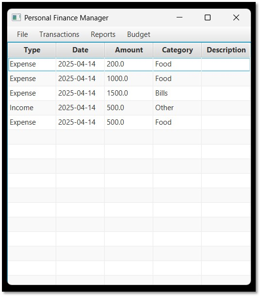

---

### ➕ Add Transaction Page
<div align="center">
  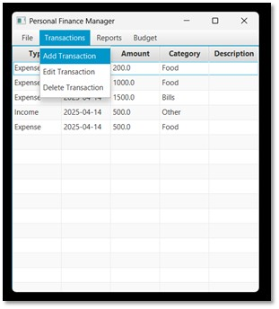
  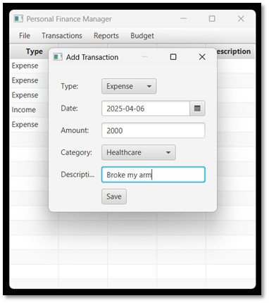
</div>

---

### ✏️ Edit Transaction Page (Before & After Update)
<div align="center">
  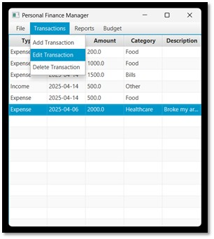
  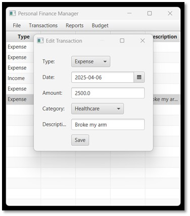
  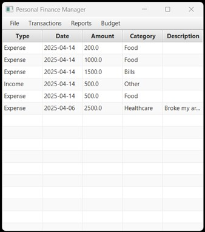
</div>

---

### 🧾 Category Budget Update Page
<div align="center">
  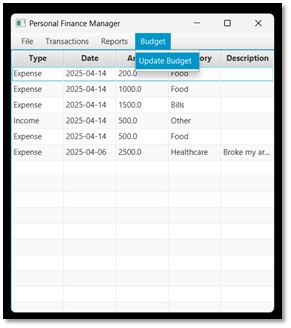
  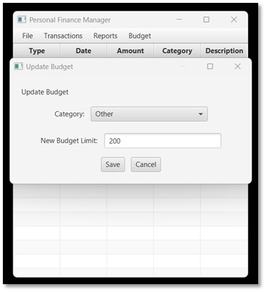
</div>

---

### 📂 Categorized Summary View
<div align="center">
  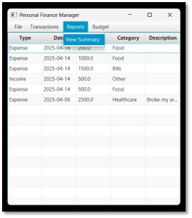
  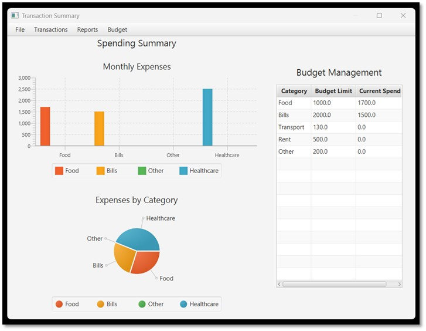
</div>

---

### ❌ Delete Transaction Confirmation
<div align="center">
  
  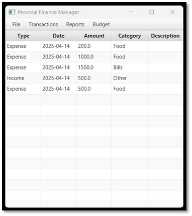
</div>


---

## 🧑‍💻 Author

Ashwin B N  
